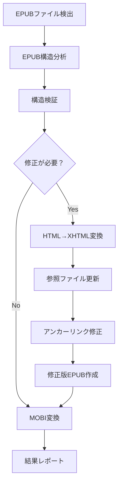

# EPUB→MOBI変換統合スクリプト

EPUBファイルの構造検証・修正からKindleGenによるMOBI変換まで、一連の処理を自動化する統合スクリプトです。

## 概要

このスクリプトは、EPUBファイルをKindle用MOBIファイルに変換する際に発生する一般的なエラーを自動的に検出・修正し、確実にMOBI変換を行います。

### 主な機能

- 📋 **EPUB構造の自動検証** - container.xml解析による柔軟な構造検出
- 🔧 **包括的エラー修正** - HTML→XHTML変換、アンカーリンク修正
- 📚 **一括処理** - ディレクトリ内の全EPUBファイルを順次処理
- 📊 **詳細ログ出力** - 処理結果とエラーの完全追跡
- ⚡ **汎用性** - 様々なEPUB構造に自動対応

## インストール

### 必要な環境

- **macOS/Linux** - Bashシェルが利用可能な環境
- **KindleGen** - Amazon提供のMOBI変換ツール
- **基本コマンド** - `unzip`, `zip`, `find`, `sed`, `grep`

### KindleGenのセットアップ

```bash
# KindleGenをダウンロード（Amazonの公式サイトから）
# パスを通すか、スクリプト内のKINDLEGEN_CMDを適切に設定
export PATH=$PATH:/path/to/kindlegen
```

## 使用方法

### 基本的な使い方

```bash
# スクリプトに実行権限を付与
chmod +x epub_to_mobi_processor.sh

# スクリプトと同じディレクトリのEPUBファイルを処理
./epub_to_mobi_processor.sh

# 特定のディレクトリを指定
./epub_to_mobi_processor.sh /path/to/epub/directory

# ヘルプ表示
./epub_to_mobi_processor.sh --help
```

### コマンドオプション

| オプション | 説明 |
|-----------|------|
| `-h, --help` | ヘルプメッセージを表示 |
| `[ディレクトリ]` | 処理対象ディレクトリ（省略時はスクリプト設置ディレクトリ） |

### 実行例

```bash
# 現在のディレクトリの全EPUBを変換
./epub_to_mobi_processor.sh

# 指定ディレクトリの全EPUBを変換
./epub_to_mobi_processor.sh ~/Documents/Books

# 絶対パスで指定
./epub_to_mobi_processor.sh "/Volumes/External/EPUB Collection"
```

## 出力ファイル

処理が完了すると、以下のファイルが生成されます：

### 生成ファイル一覧

| ファイル形式 | ファイル名 | 説明 |
|-------------|-----------|------|
| **MOBIファイル** | `[元ファイル名].mobi` | 変換されたKindle用ファイル |
| **修正版EPUB** | `[元ファイル名]_KindleReady.epub` | 修正後のEPUBファイル（バックアップ） |
| **ログファイル** | `epub_processing_YYYYMMDD_HHMMSS.log` | 詳細な処理ログ |

### ファイル例

```
元ファイル: 現実主義勇者の王国再建記_02.epub
↓
生成ファイル:
├── 現実主義勇者の王国再建記_02.mobi              # Kindle用ファイル
├── 現実主義勇者の王国再建記_02_KindleReady.epub  # 修正版EPUB
└── epub_processing_20250123_143022.log           # 処理ログ
```

## 処理フロー



## 対応するEPUBエラー

### 自動修正される問題

- ✅ **E1005: Could not access file**
  - HTML/XHTML拡張子の不一致を修正
  
- ✅ **E24010: Hyperlink not resolved in toc**
  - 複雑なアンカーIDを削除・簡素化
  
- ✅ **E24001: Table of content could not be built**
  - 目次構造の問題を修正
  
- ✅ **W14001: Hyperlink not resolved**
  - 内部リンクの参照エラーを修正

### 対応するEPUB構造

| 構造タイプ | OPFパス | 対応状況 |
|----------|---------|---------|
| 標準構造 | `content.opf` | ✅ |
| OEBPS構造 | `OEBPS/content.opf` | ✅ |
| item構造 | `item/standard.opf` | ✅ |
| OPS構造 | `OPS/content.opf` | ✅ |

## 設定とカスタマイズ

### スクリプト内設定項目

```bash
# KindleGenコマンドパス
KINDLEGEN_CMD="kindlegen"

# 修正対象の複雑なアンカーパターン
patterns=(
    's/#[a-zA-Z0-9-]*-[a-fA-F0-9]\{32\}//g'          # 32文字16進数
    's/#[0-9a-zA-Z-]*-[a-fA-F0-9]\{8\}-[a-fA-F0-9]\{4\}-[a-fA-F0-9]\{4\}-[a-fA-F0-9]\{4\}-[a-fA-F0-9]\{12\}//g'  # UUID形式
    # その他のパターン...
)
```

### 環境に合わせた調整

```bash
# KindleGenのパスを変更する場合
sed -i 's|KINDLEGEN_CMD="kindlegen"|KINDLEGEN_CMD="/usr/local/bin/kindlegen"|' epub_to_mobi_processor.sh
```

## トラブルシューティング

### よくある問題と解決方法

#### 1. KindleGenが見つからない

**エラー:**
```
❌ ERROR: kindlegenコマンドが見つかりません: kindlegen
```

**解決方法:**
```bash
# KindleGenをダウンロードしてインストール
# またはスクリプト内のパスを修正
which kindlegen  # インストール確認
```

#### 2. EPUBファイルが見つからない

**エラー:**
```
❌ ERROR: EPUBファイルが見つかりません: /path/to/directory
```

**解決方法:**
```bash
# ディレクトリパスが正しいか確認
ls -la /path/to/directory/*.epub

# 相対パスで実行
./epub_to_mobi_processor.sh ./epub_files/
```

#### 3. 権限エラー

**エラー:**
```
zsh: permission denied: ./epub_to_mobi_processor.sh
```

**解決方法:**
```bash
chmod +x epub_to_mobi_processor.sh
```

#### 4. 特殊文字を含むファイル名

**対応:**
- ファイル名に特殊文字や絵文字が含まれる場合も正常に処理
- ログファイルで詳細な処理状況を確認可能

## ログファイルの見方

### 処理状況の確認

```bash
# 最新のログファイルを確認
tail -f epub_processing_*.log

# エラーのみを抽出
grep "❌ ERROR" epub_processing_*.log

# 成功したファイル一覧
grep "✅ SUCCESS" epub_processing_*.log
```

### ログの種類

| アイコン | レベル | 意味 |
|---------|--------|------|
| ✅ | SUCCESS | 処理成功 |
| ❌ | ERROR | エラー発生 |
| ⚠️ | WARNING | 警告 |
| ℹ️ | INFO | 一般情報 |

## パフォーマンス

### 処理時間の目安

| ファイルサイズ | 処理時間（目安） |
|---------------|----------------|
| ~5MB | 10-20秒 |
| 5-10MB | 20-40秒 |
| 10MB+ | 40秒~ |

### バッチ処理の効率化

```bash
# 大量ファイルの場合はバックグラウンド実行
nohup ./epub_to_mobi_processor.sh /large/epub/collection > batch.log 2>&1 &

# 処理状況の監視
tail -f batch.log
```

## 開発・拡張

### スクリプトの構造

```
epub_to_mobi_processor.sh
├── 設定値・変数定義
├── ユーティリティ関数
├── EPUB検証機能
├── EPUB修正機能
├── EPUB再構築機能
├── MOBI変換機能
└── メイン処理・レポート機能
```

### カスタム修正パターンの追加

```bash
# fix_anchor_links_comprehensive() 関数内
local patterns=(
    # 既存パターン...
    's/#custom-pattern-[0-9]+//g'    # カスタムパターンを追加
)
```

## 関連ファイル

このリポジトリには以下の関連ファイルも含まれています：

| ファイル | 説明 |
|---------|------|
| `EPUB_KindleGen_修正ガイド.mdc` | 詳細な修正ガイドとエラー対応 |
| `convert_epubs_with_error_log.sh` | シンプルな変換スクリプト |
| `fix_epub_batch.sh` | 基本的なEPUB修正スクリプト |
| `fix_anchors_comprehensive.sh` | アンカーリンク修正専用スクリプト |
| `create_fixed_epubs.sh` | 修正版EPUB作成スクリプト |

## ライセンス

このスクリプトは個人利用・商用利用ともに自由に使用できます。

## 更新履歴

### v1.0.0 (2025-01-23)
- 初回リリース
- 基本的なEPUB修正・MOBI変換機能
- 包括的なアンカーリンク修正
- 詳細なログ出力機能
- 柔軟なディレクトリ指定機能
- ヘルプ機能追加

## 貢献

バグ報告や機能改善のご提案は、GitHub Issues またはPull Requestをお送りください。

---

**作成者**: AI Assistant  
**作成日**: 2025年1月23日  
**対象**: EPUB → MOBI変換（KindleGen使用）
